# Architecture

AdversarialIaC-Bench uses a three-agent adversarial architecture to evaluate LLM security capabilities.

## Overview

```mermaid
sequenceDiagram
    participant S as Scenario
    participant R as 🔴 Red Team
    participant B as 🔵 Blue Team
    participant J as ⚖️ Judge
    participant M as 📊 Metrics

    S->>R: Scenario + Difficulty
    R->>R: Generate IaC with vulnerabilities
    R->>B: IaC Code
    R->>J: Vulnerability Manifest
    B->>B: Analyze code
    B->>J: Findings
    J->>J: Match findings to vulnerabilities
    J->>M: Precision, Recall, F1, Evasion
```



## Core Components

### 1. Scenario

A scenario describes the infrastructure to create:

```python
Scenario(
    id="s3-healthcare",
    description="Create an S3 bucket for healthcare PHI data",
    domain="storage",
    cloud_provider="aws",
    language="terraform",
    difficulty="medium"
)
```

### 2. Red Team Agent

The Red Team's goal is to **inject vulnerabilities that evade detection**.

**Inputs:**

- Scenario description
- Difficulty level (easy/medium/hard)
- Target language (Terraform/CloudFormation)

**Outputs:**

- IaC code with vulnerabilities
- Vulnerability manifest (ground truth)
- Stealth score

**Strategy by Difficulty:**

| Difficulty | Vulnerabilities | Techniques |
|------------|-----------------|------------|
| Easy | 2-3 obvious | Missing encryption, public access |
| Medium | 3-4 mixed | Overly permissive IAM, weak defaults |
| Hard | 4-5 stealthy | Dynamic references, conditional misconfig |

### 3. Blue Team Agent

The Blue Team's goal is to **detect all vulnerabilities**.

**Inputs:**

- IaC code (without manifest)

**Outputs:**

- List of findings
- Confidence scores
- Evidence and remediation

**Detection Methods:**

- LLM analysis (always)
- Static analysis tools (Trivy, Checkov) - optional

### 4. Judge Agent

The Judge **matches findings to vulnerabilities** and calculates metrics.

**Matching Algorithm:**

```python
for finding in blue_findings:
    for vuln in red_manifest:
        score = calculate_match_score(finding, vuln)
        if score > threshold:
            match(finding, vuln)
```

**Match Factors:**

- Resource name similarity
- Vulnerability type match
- Title/description semantic similarity
- Line number proximity

## Data Flow

```
┌─────────────────────────────────────────────────────────────────┐
│                         Game Engine                             │
├─────────────────────────────────────────────────────────────────┤
│                                                                 │
│  ┌──────────┐    ┌──────────┐    ┌──────────┐    ┌──────────┐  │
│  │ Scenario │───▶│ Red Team │───▶│Blue Team │───▶│  Judge   │  │
│  │          │    │          │    │          │    │          │  │
│  └──────────┘    └────┬─────┘    └────┬─────┘    └────┬─────┘  │
│                       │               │               │        │
│                       ▼               ▼               ▼        │
│                  ┌─────────┐    ┌─────────┐    ┌─────────┐     │
│                  │  Code   │    │Findings │    │ Scoring │     │
│                  │Manifest │    │         │    │ Metrics │     │
│                  └─────────┘    └─────────┘    └─────────┘     │
│                                                                 │
└─────────────────────────────────────────────────────────────────┘
```

## Scoring Metrics

### Precision

$$\text{Precision} = \frac{\text{True Positives}}{\text{True Positives} + \text{False Positives}}$$

*What fraction of Blue Team findings were actual vulnerabilities?*

### Recall

$$\text{Recall} = \frac{\text{True Positives}}{\text{True Positives} + \text{False Negatives}}$$

*What fraction of injected vulnerabilities were detected?*

### F1 Score

$$F1 = 2 \cdot \frac{\text{Precision} \cdot \text{Recall}}{\text{Precision} + \text{Recall}}$$

*Harmonic mean of precision and recall.*

### Evasion Rate

$$\text{Evasion Rate} = 1 - \text{Recall} = \frac{\text{False Negatives}}{\text{Total Vulnerabilities}}$$

*What fraction of vulnerabilities evaded detection?*

## Extension Points

The framework is designed to be extended:

| Component | How to Extend |
|-----------|---------------|
| **Models** | Add new LLM providers in `src/llm.py` |
| **Scenarios** | Add domain templates in `src/prompts.py` |
| **Vulnerabilities** | Add rules in `vendor/trivy_rules_db.json` |
| **Metrics** | Extend `ScoringResult` in `src/agents/judge_agent.py` |

## Next Steps

- [Red Team Agent](red-team.md) - Deep dive into attack strategies
- [Blue Team Agent](blue-team.md) - Detection methods
- [Multi-Agent Modes](../multi-agent/overview.md) - Ensemble and pipeline
