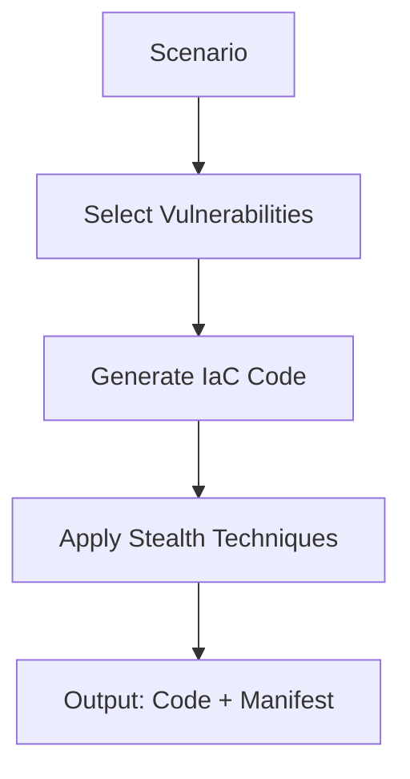

# Red Team Agent

The Red Team agent's goal is to generate IaC code with **stealthy vulnerabilities** that evade detection.

## Overview



## Vulnerability Selection

The Red Team selects vulnerabilities from a database of real-world security issues:

- **142 Terraform AWS rules** from Trivy
- **100+ CloudFormation rules** 
- Categorized by type: encryption, access control, network, IAM, logging

## Stealth Techniques

### Easy Mode
- Obvious misconfigurations
- Missing encryption
- Public access enabled

### Medium Mode
- Overly permissive IAM policies
- Weak default configurations
- Missing logging

### Hard Mode
- Dynamic resource references
- Conditional misconfigurations
- Split across multiple files
- Legitimate-looking comments

## Output Format

```json
{
  "code": {
    "main.tf": "...",
    "variables.tf": "..."
  },
  "manifest": [
    {
      "vuln_id": "V001",
      "type": "encryption",
      "resource": "aws_s3_bucket.data",
      "description": "S3 bucket lacks encryption",
      "severity": "high"
    }
  ],
  "stealth_score": 0.8
}
```

## Extending

Add new vulnerability types in `vendor/trivy_rules_db.json`.
