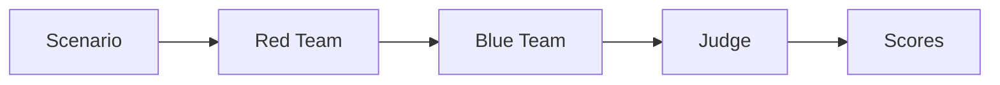

# Adversarial IaC Benchmark

**Red Team vs Blue Team security evaluation for Infrastructure-as-Code.**

## How It Works


```mermaid
flowchart LR
    S[Scenario] --> R[Red Team]
    R --> B[Blue Team]
    B --> J[Judge]
    J --> S2[Scores]
```

1. **Scenario** — "Create an S3 bucket for healthcare PHI data"
2. **Red Team** — Generates code with hidden vulnerabilities
3. **Blue Team** — Analyzes code to find them
4. **Judge** — Scores precision, recall, F1, evasion rate

## Get Started

```bash
adversarial-iac play
```

The interactive wizard guides you through scenario selection, model choice, and explains results.

## Next Steps

- [Quick Start](getting-started/quickstart.md) — Install and run your first game
- [CLI Reference](cli/game.md) — All commands and options with examples
- [Experiments](experiments/batch.md) — Batch runs with YAML config
