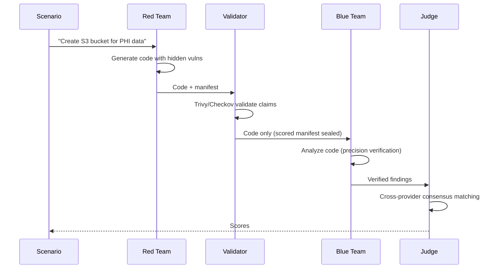

# How It Works

The Adversarial IaC Game pits two AI agents against each other in a security challenge.

## The Players

| Player | Role | Goal |
|--------|------|------|
| Red Team | Attacker | Hide vulnerabilities in code |
| Blue Team | Defender | Find the hidden vulnerabilities |
| Judge | Referee | Score who won |

## Game Flow



## Step by Step

### 1. Scenario

A scenario describes what infrastructure to create, e.g. "Create an S3 bucket for healthcare PHI data with encryption." 114 built-in scenarios across Healthcare, Financial, Government, and infrastructure domains.

### 2. Red Team

Receives the scenario and:

1. Creates legitimate-looking code
2. Injects hidden vulnerabilities (complexity depends on difficulty — not quantity)
3. Documents what they hid in a manifest (ground truth)

Output: `main.tf` (or CloudFormation) and `red_team_manifest.json`.

!!! warning "Manifest integrity"
    Red Team must document every vulnerability accurately. Difficulty controls stealth and complexity, never error rate. Manifests are validated by static tools before scoring.

### 3. Validator (v2.3)

Runs Trivy and Checkov on the generated code and cross-references each manifest entry:

- **Confirmed entries** → `scored_manifest.json` (used for scoring)
- **Unconfirmed entries** → `phantom_manifest.json` (excluded from scoring)

This prevents phantom concordance — where Red and Blue LLMs agree on vulnerabilities that don't actually exist.

### 4. Blue Team

Receives only the code (not the manifest):

1. Analyzes the code using LLM reasoning (and optionally Trivy/Checkov)
2. **Precision verification** (v2.3): Each finding must cite exact code evidence. Unsubstantiated findings are removed.
3. Reports verified findings with severity, location, evidence

Output: `blue_team_findings.json`.

### 5. Judge

Compares scored manifest vs verified findings using optimal bipartite matching. For novel vulnerabilities, uses cross-provider consensus (OpenAI + Google) to prevent shared-training bias. Calculates:

| Metric | Meaning |
|--------|---------|
| **Precision** | How accurate were Blue's reports? (TP / (TP + FP)) |
| **Recall** | What % of Red's vulns did Blue find? (TP / (TP + FN)) |
| **F1** | Overall Blue performance |
| **Evasion Rate** | What % of vulns did Red hide successfully? |
| **Phantom Concordance Rate** | % of matches on unconfirmed manifest entries |

## Output

```
output/games/G-YYYYMMDD_HHMMSS/
├── code/main.tf
├── red_team_manifest.json
├── scored_manifest.json          # Tool-confirmed entries (v2.3)
├── phantom_manifest.json         # Unconfirmed entries excluded from scoring (v2.3)
├── blue_team_findings.json
├── game_result.json
└── game.log
```
